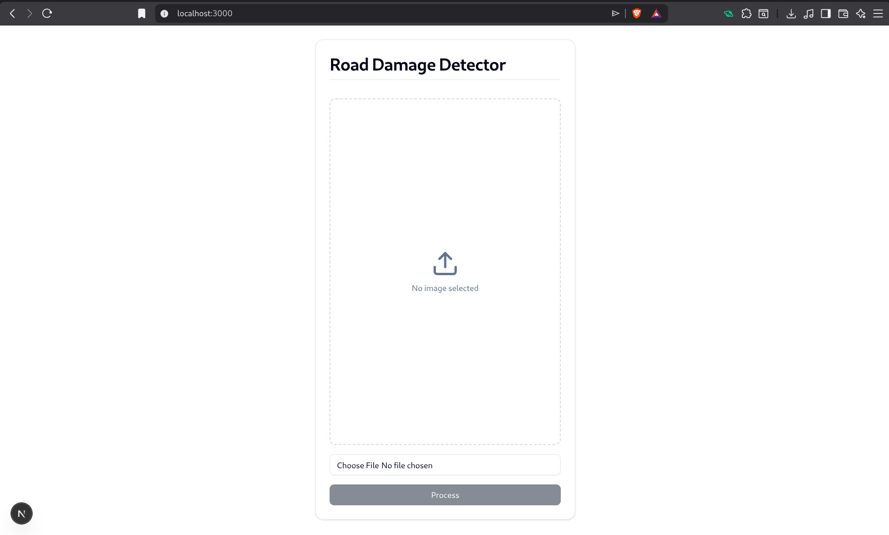
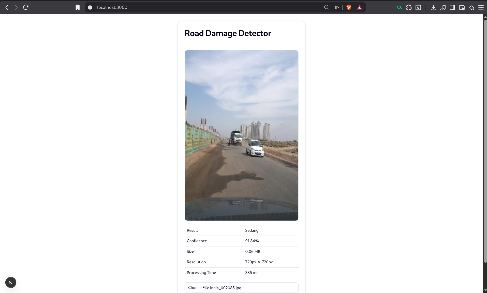

# 🛣️ Road Damage Detection

Aplikasi web untuk mendeteksi tingkat kerusakan jalan menggunakan teknologi AI (ONNX Model). Cukup upload foto jalan, dan sistem akan menganalisis tingkat kerusakannya secara otomatis!





## 📋 Tentang Aplikasi

Aplikasi ini dibuat untuk membantu mengidentifikasi kondisi jalan dengan cepat dan akurat menggunakan model Machine Learning. Sistem akan mengklasifikasikan kerusakan jalan ke dalam 4 kategori:

- **Normal** - Jalan dalam kondisi baik
- **Ringan** - Kerusakan kecil yang perlu perhatian
- **Sedang** - Kerusakan yang memerlukan perbaikan segera
- **Berat** - Kerusakan parah yang berbahaya

## ✨ Fitur Utama

- 🖼️ **Upload Gambar** - Mendukung format JPG, JPEG, dan PNG
- 🤖 **Deteksi AI** - Menggunakan model ONNX yang dilatih khusus untuk deteksi kerusakan jalan
- 📊 **Hasil Detail** - Menampilkan tingkat kerusakan, confidence score, ukuran file, resolusi, dan waktu proses
- ⚡ **Cepat & Responsif** - Proses deteksi dilakukan langsung di browser
- 🎨 **UI Modern** - Menggunakan shadcn/ui untuk tampilan yang clean dan profesional

## 🚀 Cara Menggunakan

### Instalasi

1. **Clone repository ini**
   ```bash
   git clone https://github.com/randy-ar/road-damage-detection.git
   cd road-damage-detection
   ```

2. **Install dependencies**
   ```bash
   npm install
   ```

3. **Jalankan aplikasi**
   ```bash
   npm run dev
   ```

4. **Buka browser**
   
   Akses [http://localhost:3000](http://localhost:3000)

### Menggunakan Aplikasi


1. **Upload Foto Jalan**
   - Klik tombol "Choose File" atau area upload
   - Pilih foto jalan dari komputer Anda (format: JPG, JPEG, atau PNG)
   - Preview foto akan muncul otomatis

2. **Proses Deteksi**
   - Klik tombol **"Process"**
   - Tunggu beberapa saat (biasanya < 1 detik)
   - Sistem akan menganalisis foto menggunakan AI


3. **Lihat Hasil**
   - Hasil deteksi akan muncul dalam bentuk tabel
   - Informasi yang ditampilkan:
     - **Result**: Tingkat kerusakan (Normal/Ringan/Sedang/Berat)
     - **Confidence**: Tingkat keyakinan AI (dalam persen)
     - **Size**: Ukuran file foto
     - **Resolution**: Resolusi foto (lebar × tinggi)
     - **Processing Time**: Waktu yang dibutuhkan untuk analisis

## 🛠️ Teknologi yang Digunakan

- **Next.js 15** - Framework React untuk production
- **TypeScript** - Type-safe JavaScript
- **ONNX Runtime Web** - Menjalankan model AI di browser
- **shadcn/ui** - Komponen UI modern dan accessible
- **Tailwind CSS** - Styling yang efisien
- **React Hook Form** - Form management

## 📁 Struktur Project

```
road-damage-detection/
├── app/                          # Next.js app directory
├── components/
│   ├── pages/
│   │   └── RoadDetection.tsx    # Komponen utama deteksi
│   └── ui/                      # Komponen UI (shadcn)
├── lib/
│   ├── road-damage-detector.ts  # Logic deteksi ONNX
│   ├── onnx-utils.ts           # Utilities preprocessing
│   └── utils.ts                # Helper functions
├── public/
│   └── models/                 # Model ONNX
│       └── road_damage_classifier_single.onnx
└── README.md
```

## 🧠 Tentang Model AI

Model yang digunakan adalah **custom ONNX model** yang telah dilatih khusus untuk mendeteksi kerusakan jalan. Model ini:

- Menggunakan arsitektur neural network yang efisien
- Dioptimasi untuk berjalan di browser menggunakan WebAssembly
- Ukuran model: ~16 MB (single file dengan embedded weights)
- Input: Gambar 224×224 pixels (RGB)
- Output: 4 kelas (Normal, Ringan, Sedang, Berat)

## 🔧 Troubleshooting

### Model tidak load / Error saat load model

Pastikan file model ada di folder `public/models/`:
```bash
ls public/models/road_damage_classifier_single.onnx
```

### Warning "Unknown CPU vendor"

Warning ini aman dan tidak mempengaruhi fungsionalitas. Sudah di-suppress di kode.

### Gambar tidak bisa diupload

Pastikan format gambar adalah JPG, JPEG, atau PNG. Format lain tidak didukung.

## 📝 Development

### Build untuk Production

```bash
npm run build
npm start
```

### Linting

```bash
npm run lint
```

## 🤝 Kontribusi

Kontribusi sangat diterima! Silakan:

1. Fork repository ini
2. Buat branch baru (`git checkout -b feature/AmazingFeature`)
3. Commit perubahan (`git commit -m 'Add some AmazingFeature'`)
4. Push ke branch (`git push origin feature/AmazingFeature`)
5. Buat Pull Request

## 📄 License

Project ini dibuat untuk keperluan edukasi dan penelitian.

## 👨‍💻 Author

**Randy AR**

- GitHub: [@randy-ar](https://github.com/randy-ar)
- Repository: [road-damage-detection](https://github.com/randy-ar/road-damage-detection)

## 🙏 Acknowledgments

- Next.js Team untuk framework yang luar biasa
- ONNX Runtime untuk inference engine
- shadcn untuk komponen UI yang beautiful
- Semua kontributor open source

---

**Dibuat dengan ❤️ menggunakan Next.js dan ONNX**
